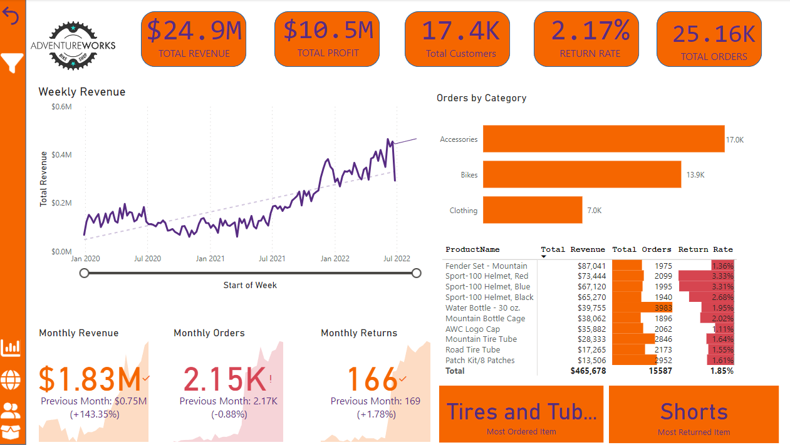

# Adventure Works Sales Analysis Project

## Introduction

The Adventure Works Sales Analysis project is aimed at analyzing the sales data of the company "Adventure Works." The project utilizes Microsoft Power BI and DAX (Data Analysis Expressions) commands to extract valuable insights from the sales data. The data was collected over a period of time, and the analysis provides various key metrics and visualizations to understand the company's sales performance and customer behavior.

## Technologies Used

- Microsoft Power BI
- Data Analysis Expressions (DAX)

## Dataset

The dataset used for this project contains historical sales data from Adventure Works. It includes information about sales orders, customer details, product information, order dates, and other relevant attributes required for the analysis.

## Objectives

The primary objectives of this project are as follows:

1. Analyze weekly revenue, profit, and return rate orders.
2. Examine monthly revenue, orders, and returns to identify trends.
3. Determine the most returned item and most ordered item.
4. Calculate the total number of unique customers and their contributions to revenue.
5. Identify the top customers by revenue.
6. Create an interactive dashboard to present the findings visually.

## DAX Commands

Throughout the project, the following DAX commands were used to perform calculations and derive meaningful insights:

1. `CALCULATE`: Used to modify or filter the context of a calculation.
2. `SUMX`: Used to calculate a sum over a table, applying an expression to each row.
3. `COUNTROWS`: Used to count the number of rows in a table.
4. `FILTER`: Used to filter a table or expression, based on specific conditions.
5. `RANKX`: Used to rank items based on a specified expression.
6. `RELATED`: Used to retrieve related values from another table.

## Dashboard Overview

The interactive dashboard developed as part of this project provides a comprehensive view of Adventure Works' sales performance and customer behavior.

# Overall Dashboard

Here is a brief overview of the dashboard components:

1. **Weekly Metrics**: Visualizations showing weekly revenue, profit, and return rate orders.
2. **Monthly Trends**: Visualizations displaying monthly revenue, orders, and returns to identify patterns over time.
3. **Most Returned and Most Ordered Items**: Charts highlighting the products with the highest return rate and the most popular items.
4. **Customer Analysis**: Metrics such as the total number of unique customers and their contribution to revenue.
5. **Top Customers**: Visualizing the top customers based on their revenue contribution.

## Conclusion

The Adventure Works Sales Analysis project successfully presents a detailed examination of the company's sales data, enabling stakeholders to gain valuable insights into their sales performance and customer behavior. By using Microsoft Power BI and DAX commands, the project offers a user-friendly dashboard that facilitates better decision-making and provides a solid foundation for further analysis and improvements.

## How to Use the Repository

If you wish to explore the project and interact with the dashboard, follow these steps:

1. Clone the repository to your local machine.
2. Open the project in Microsoft Power BI.
3. Ensure you have the necessary data files or connections to the data source.
4. Refresh the data to ensure the latest information is loaded.
5. Explore the dashboard to view the various visualizations and insights.

## Acknowledgments

We would like to express our gratitude to Adventure Works for providing the sales data for this analysis. Additionally, we extend our appreciation to the Microsoft Power BI and DAX communities for their valuable resources and support.
